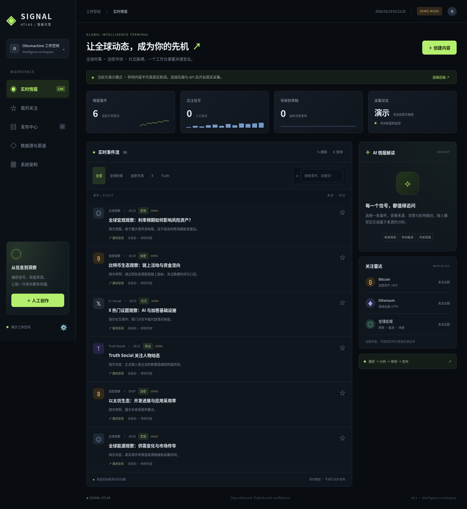

# Signal Atlas / auto-post

全球情报采集、AI 解读、人工审核与多平台发布工作台。

**状态：可运行的 v0.1 单管理员 MVP。** 默认演示数据，未配置 API 时不会伪造真实新闻、AI 分析或发布成功。服务器部署与业务 API 接入需另行完成。



## 已实现

- 中文响应式暗色控制台：事件搜索、来源筛选、关注、AI 分析、人工创作、审核、内容导出、渠道状态。
- FastAPI API，管理令牌认证，SQLite WAL 持久化，RSS / X 最近搜索轮询，来源 ID 去重。
- OpenAI 兼容 JSON 分析：摘要、影响路径、不确定性、草稿；分析结果缓存。
- 草稿审核门槛，X / Telegram 发布适配器，渠道唯一提交记录，超时结果标记 unknown。
- 币安广场、OKX、Truth 为人工导出渠道；Truth 真实采集未实现。
- Docker Compose、Caddy HTTPS、非 root 容器、持久化数据卷、GitHub Actions CI。

## 本地运行

```bash
python -m pip install -r requirements.txt
export APP_MODE=demo
export ADMIN_TOKEN="$(python -c 'import secrets; print(secrets.token_urlsafe(36))')"
uvicorn backend.app.main:app --host 127.0.0.1 --port 8000
```

打开 http://127.0.0.1:8000。页面默认展示演示样例；点击左下角设置，后端地址留空，输入自己生成的 ADMIN_TOKEN 后连接。令牌仅保存在页面内存中。也可单独以静态服务器运行 `frontend/dist` 预览布局；静态预览中的草稿只保存在当前标签页。

## 服务器部署

参考 [部署手册](docs/DEPLOYMENT.md)。复制 `.env.example` 为 `.env`，在服务器生成管理令牌；配置域名与 API 后执行 `docker compose up -d --build`。只有 `APP_MODE=live` 才采集真实数据并允许对外发布。演示模式仍需管理令牌才可访问后端业务 API。

所有密钥通过服务器环境或受控密钥管理器提供，不提交到 GitHub。当前仓库没有任何服务器密码、账户令牌或业务密钥。

## 文档

- [架构、数据流和完整目标结构](docs/ARCHITECTURE.md)
- [需要提供的 API 与权限](docs/API-CHECKLIST.md)
- [部署、备份与回滚](docs/DEPLOYMENT.md)
- [人工发文 API](docs/MANUAL-POST-API.md)
- [验收范围与已知限制](docs/ACCEPTANCE.md)

## 验证

```bash
pytest -q
node --check frontend/dist/assets/app.js
```

当前产品不是交易机器人。自动化采集与发布依赖来源授权、平台套餐和接口能力；X 最近搜索不等同于流式全量采集，默认轮询间隔为 60 秒。

当前指定方案：服务器现有 Nginx + auto-post.maxson.cc + SiliconFlow GLM，见 [专项部署说明](docs/NGINX-SILICONFLOW.md)。X、RSS、Telegram 暂未提供，默认来源列表为空。
