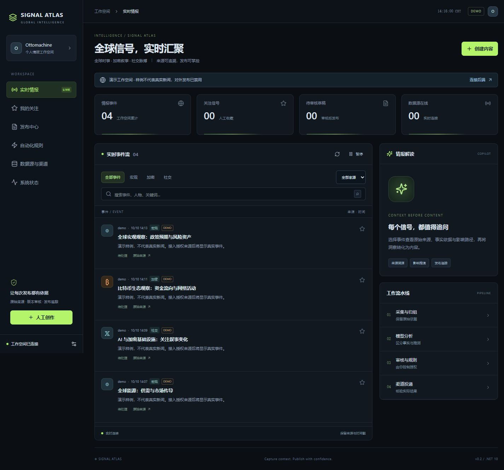

# Signal Atlas / auto-post

全球情报采集、来源溯源、模型分析、人工创作及白名单发布工作台。

v0.5.4 使用 **.NET 10 + React / TypeScript + PostgreSQL**，包含持久任务、图片编辑器和支持选择模型的悬浮Agent。本地默认演示模式，自动规则默认关闭；没有真实凭据时不伪造分析、采集或发布成功。

生产验收与剩余接入项见 [上线完成度](docs/RELEASE-GATES.md)，登录方式见 [管理访问令牌](docs/ADMIN-ACCESS.md)。



## 本地运行

需要 .NET 10 SDK、Node.js 24+ 和 Docker。以下为 PowerShell，密码仅用于可丢弃的开发数据库：

```powershell
docker run -d --name auto-post-dev-db -e POSTGRES_PASSWORD=autopost-local-only -e POSTGRES_DB=autopost -p 127.0.0.1:55432:5432 postgres:17-alpine
npm ci --prefix web
npm run build --prefix web
dotnet run --project tools/AutoPost.Tools -- migrate
dotnet run --project tools/AutoPost.Tools -- seed-demo
$env:APP_MODE='demo'
$env:ADMIN_TOKEN=[Convert]::ToHexString([Security.Cryptography.RandomNumberGenerator]::GetBytes(32))
# 在私有终端查看此值用于页面登录，不提交仓库
dotnet run --project src/AutoPost.Api --urls http://127.0.0.1:5080 --environment Development
```

打开 [本地工作台](http://127.0.0.1:5080)。使用相同环境设置，在另一个终端启动 `dotnet run --project src/AutoPost.Worker`。前端开发使用 `npm run dev --prefix web`，自动代理 API 和 SignalR 到5080。

真实模式需 API 和 Worker 都设置`APP_MODE=live`；通过页面添加来源。Key仅通过环境或服务器私有`.env`提供。

## 功能

- 模块化 API / Worker / Core / Infrastructure，EF Core 显式迁移与 PostgreSQL 持久任务。
- RSS 公共 HTTPS 限制；X 分页、断点游标、429退避；跨来源关联。
- 采集、分析、发布三个独立执行通道，每类通道有数据库领导锁。
- 自动模型分析、事实依据、影响推测、不确定性、候选草稿和每日预算。
- 版本化草稿、明确版本审核、规则试运行、白名单与配额、全局暂停。
- X / Telegram 文本发布、人工导出、结果不明人工核验、明确失败人工重试。
- 响应式 React 页面、虚拟列表、游标分页、SignalR与HTTP恢复。
- HttpOnly会话、防伪校验、同源检查、Bearer兼容与审计。
- SQLite幂等导入与旧草稿隔离、PostgreSQL备份恢复、Docker部署。

## 验证与文档

```powershell
dotnet test AutoPost.sln
npm run build --prefix web
# CI或安装Chromium的开发环境
npm run test:e2e --prefix web
```

- [架构](docs/ARCHITECTURE-V2.md)
- [新版API](docs/API-V2.md)
- [API与权限清单](docs/API-CHECKLIST.md)
- [部署与回滚](docs/DEPLOYMENT-V2.md)
- [实际验收与限制](docs/ACCEPTANCE-V2.md)

旧Python和部署模板保留供迁移核对，新版只使用`deploy/compose.dotnet.yaml`。不要同时运行旧、新发布器。

首期单管理员、每渠道一个default账号、中文分析、纯文本发布。Truth暂无真实采集，币安/OKX/Truth人工导出；X为最近搜索，OAuth自动刷新未实现，过期授权会阻止投递。

## v0.4 创作与云数据库适配

新增普通推文式图片编辑器、X/币安图片发布适配，以及MySQL 8.4兼容和完整字段核对导入工具。详见 [创作与云数据库说明](docs/COMPOSER-CLOUD.md)。远端MySQL切换须先提供受信任CA证书，当前生产数据库状态以验收记录为准。
