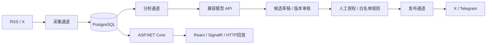

# v0.2 架构与状态机

API只创建任务，Worker执行外部请求。Worker运行采集、分析、发布三个独立通道；模型不会阻塞采集或发布。每类通道使用PostgreSQL会话领导锁，误启动第二个Worker也不会并发执行同类任务。任务使用`FOR UPDATE SKIP LOCKED`和30分钟租约。X每轮最多20页，未完成保存next_token并立即继续；全部页完成才推进since_id。不保证超过平台最近搜索窗口的补采。

EF Core显式迁移仅由工具执行。初始迁移是审阅过的SQL，后续调整需新增迁移，不修改已执行迁移。业务变更、审计、增量记录同事务保存。SignalR通知用于提示，HTTP回放用于断线恢复。当前单API实例，不使用Redis。

来源ID去重；规范化URL、正文指纹、完全相同标题进行确定性关联，保留原始记录。这不是语义模型聚类。事件、审计、任务当前不自动清理，长期运行需评估归档策略。

## 分析与发布规则

模型每日默认100次调用，包括失败尝试，北京时间归零，并发1。模型返回摘要、事实依据、推测、不确定性、分类及草稿；记录模型、提示词版本、用量和耗时。

规则来源白名单、关键词任一命中，支持跨午夜北京时间窗口。新规则关闭，全局自动发布暂停。仅启用规则可授权新事件自动发送；暂停期间草稿不在恢复后追溯自动发布。

每规则每渠道每日10条、间隔15分钟，全局每渠道每日20条。发布前原子消耗配额；发送失败也计入尝试。配额、冷却、暂停、内容限制或版本检查不通过时标记blocked，需人工处理后重试，不自动延期发送。

草稿编辑创建新版本并取消审核。审核需指定revision，避免另一个标签页修改后误审核。排队、发送或unknown未处理时禁止编辑。每草稿版本每渠道唯一投递。

`queued → sending → published | failed | unknown`，检查失败为blocked，人工渠道为manual_required。超时、断连、5xx、无法解析成功回执为unknown，不自动重发。需核验说明，确认发布需远端ID。全局暂停不能撤回已经开始的远端请求。API成功不代表内容永久可见，也不构成跨平台精确一次保证。

## 安全与运行

管理令牌登录签发8小时HttpOnly、SameSite=Strict会话，生产Secure；Cookie写请求防伪校验，SignalR协商附防伪头并检查来源。Bearer客户端兼容。密钥不入URL、浏览器存储或日志。

RSS公共HTTPS、默认端口、不跟随重定向、DNS公共地址校验、连接固定解析地址防重绑定、响应2MB上限、禁XML实体。React渲染转义正文。

PostgreSQL与会话密钥位于数据盘。SQLite导入保留ID与时间，草稿全部隔离，sending转unknown，不创建任务。导入前停旧服务并备份WAL。

服务器当前Caddy监听443、Nginx监听80；新增Caddy TLS → Nginx专用8091 → API8090。数据库不开放公网，不替换旧服务。每渠道一个default账号；OAuth刷新、媒体、多用户及Truth授权适配未实现。
